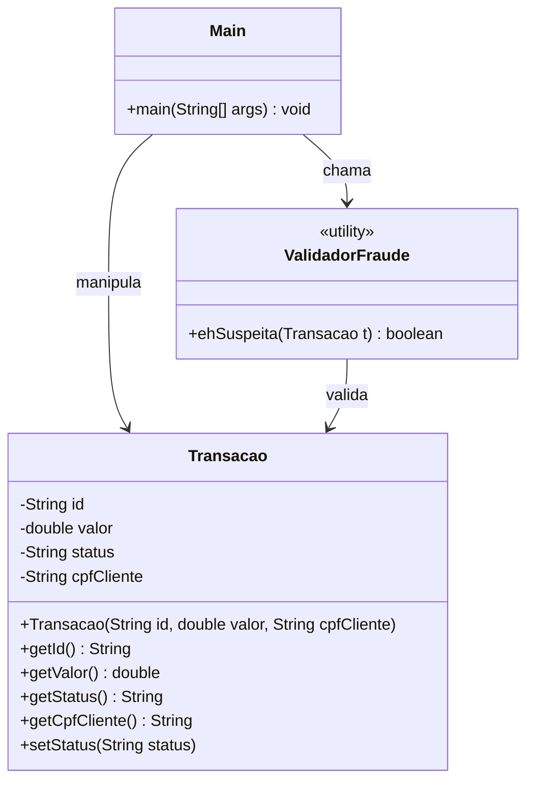
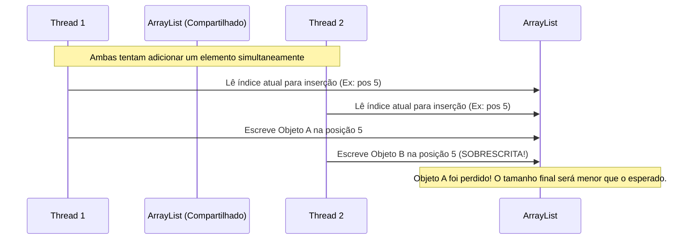

# 🛡️ Sistema Detector de Fraudes: Relatório Técnico de Implementação

Este documento apresenta a análise, a explicação detalhada do código e o relatório de performance do **Sistema Detector de Fraudes**, desenvolvido em Java. O sistema compara a eficiência do processamento sequencial em relação ao processamento paralelo utilizando a API de Streams do Java, além de explorar as nuances de concorrência e segurança de threads (*thread-safety*).

---

## 🗂️ Arquitetura do Sistema e Estrutura de Arquivos

O projeto está estruturado em três classes principais dentro da pasta `src`:
*   [Transacao.java](file:///c:/Users/ihenr/OneDrive/Desktop/Faculdade/LP/fraudes/src/Transacao.java): Define o modelo de dados de uma transação.
*   [ValidadorFraude.java](file:///c:/Users/ihenr/OneDrive/Desktop/Faculdade/LP/fraudes/src/ValidadorFraude.java): Contém a regra de negócio pesada para validar fraudes.
*   [Main.java](file:///c:/Users/ihenr/OneDrive/Desktop/Faculdade/LP/fraudes/src/Main.java): Ponto de entrada que gera dados de teste, executa as medições e analisa o comportamento concorrente.



---

## 🔍 Explicação Detalhada do Código

### 1. Modelo de Dados: `Transacao.java`
A classe representa uma transação financeira básica. De acordo com as especificações do anexo, ela define os atributos necessários e inicializa o status como `"PROCESSANDO"`.

```java
public class Transacao {
    private String id;
    private double valor;
    private String status;
    private String cpfCliente;

    // Construtor alinhado com as especificações: define o status inicial
    public Transacao(String id, double valor, String cpfCliente) {
        this.id = id;
        this.valor = valor;
        this.status = "PROCESSANDO";
        this.cpfCliente = cpfCliente;
    }

    // Getters e Setters para encapsulamento
    ...
}
```

---

### 2. Regra de Negócio: `ValidadorFraude.java`
Essa classe implementa a simulação de uma consulta pesada externa (por exemplo, consulta ao Serasa ou Receita Federal).

```java
public class ValidadorFraude {
    public static boolean ehSuspeita(Transacao t) {
        boolean ehFraude = false;
        try {
            // Simula latência de rede ou cálculo pesado (20 milissegundos)
            Thread.sleep(20);
            
            // Regra de validação: Valor maior que R$ 5000 E CPF começando com "000"
            if (t.getValor() > 5000 && t.getCpfCliente().startsWith("000")) {
                ehFraude = true;
            }
        } catch (InterruptedException e) {
            Thread.currentThread().interrupt(); // Boa prática de concorrência
        }
        return ehFraude;
    }
}
```
> [!IMPORTANT]
> A simulação do atraso de `20ms` por transação é essencial. Em um lote de 1.000 transações rodando sequencialmente, esse atraso acumula no mínimo **20 segundos** de tempo total de espera de CPU ociosa em chamadas de I/O bloqueantes.

---

### 3. Orquestração e Testes: `Main.java`
A classe `Main` executa os seguintes passos coordenados:

#### A. Geração de Dados de Teste
Cria uma lista de 1.000 transações aleatórias. Para garantir que algumas transações caiam na regra de suspeita de fraude, o código define uma probabilidade de 5%:
```java
// 5% de chance de uma transação ser suspeita de fraude
boolean isFraude = random.nextInt(100) < 5;
if (isFraude) {
    String cpfFraude = "000"; // Prefixo exigido
    for(int j = 0; j < 8; j++) cpfFraude += random.nextInt(10);
    double valorAlto = 5001.0 + random.nextInt(5000); // Valor > 5000
    transacoes.add(new Transacao(id, valorAlto, cpfFraude));
}
```

#### B. Processamento Sequencial vs. Paralelo
O processamento sequencial utiliza `.stream()`, enquanto o paralelo utiliza `.parallelStream()`. Ambos medem o tempo com `System.currentTimeMillis()`.

```java
// Sequencial
long inicioSeq = System.currentTimeMillis();
List<Transacao> fraudesSeq = transacoes.stream()
    .filter(ValidadorFraude::ehSuspeita)
    .collect(Collectors.toList());
long fimSeq = System.currentTimeMillis();

// Paralelo
long inicioPar = System.currentTimeMillis();
List<Transacao> fraudesPar = transacoes.parallelStream()
    .filter(ValidadorFraude::ehSuspeita)
    .collect(Collectors.toList());
long fimPar = System.currentTimeMillis();
```

---

## ⚡ Análise de Performance e Concurrencia

### Por que o modo Paralelo é drasticamente mais rápido?

No processamento sequencial, o Java executa o filtro em uma única thread principal. Cada elemento deve esperar o anterior concluir (um bloqueio de 20ms por transação).
*   **Tempo sequencial esperado:** $1000 \text{ transações} \times 20\text{ms} \approx 20.000\text{ms}$ (20 segundos).

No modo paralelo, a API de Streams usa o framework **ForkJoinPool** por baixo dos panos, dividindo os dados em lotes menores e distribuindo o trabalho de filtragem entre múltiplos núcleos de CPU (*threads* concorrentes).
*   **Tempo paralelo esperado:** Se a sua máquina tiver 8 núcleos lógicos de processamento, o tempo total cai para aproximadamente $20.000\text{ms} / 8 \approx 2.500\text{ms}$ (2.5 segundos) ou até menos!

```mermaid
graph TD
    subgraph Modo Sequencial (1 única Thread)
        S1[Transação 1] -->|20ms| S2[Transação 2]
        S2 -->|20ms| S3[Transação 3]
        S3 -->|...| S4[Transação 1000]
        S4 -->|Tempo Total: ~20s| SeqEnd((Fim))
    end

    subgraph Modo Paralelo (Múltiplas Threads no ForkJoinPool)
        P1[Fatia 1: Transações 1-125] -->|Thread 1| PEnd
        P2[Fatia 2: Transações 126-250] -->|Thread 2| PEnd
        P3[Fatia 3: Transações ... ] -->|Thread 3| PEnd
        P4[Fatia 4: Transações 876-1000] -->|Thread N| PEnd
        PEnd{ForkJoin Combiner} -->|Tempo Total: ~2.5s| ParEnd((Fim))
    end
```

---

## ⚠️ O Desafio Extra: Modificação de Listas Não Thread-Safe

O desafio extra demonstra o perigo de modificar o estado de coleções externas não seguras para concorrência de dentro de streams paralelos.

```java
// O Código Inseguro Proposto no Desafio:
List<Transacao> listaExternaInsegura = new ArrayList<>();
transacoes.parallelStream()
        .filter(ValidadorFraude::ehSuspeita)
        .forEach(listaExternaInsegura::add); // Modificação Concorrente Direta
```

### O Problema do `ArrayList`
O `ArrayList` não é sincronizado (*not thread-safe*). Quando múltiplas threads chamam `listaExternaInsegura.add()` ao mesmo tempo, ocorrem **Corridas de Dados** (*Data Races*):
1.  **Sobrescrita de dados:** Duas threads tentam colocar elementos na mesma posição do índice da lista, fazendo com que uma apague o elemento da outra.
2.  **Inconsistência de tamanho (`size`):** O contador de elementos internos pode ser corrompido, reportando um tamanho incorreto.
3.  **Exceções em execução:** Pode estourar uma `ArrayIndexOutOfBoundsException` ou `NullPointerException` se o array interno tentar expandir a sua capacidade concorrentemente.



### A Solução Correta: `.collect()`
O uso de `.collect(Collectors.toList())` resolve o problema de forma elegante e correta:
```java
List<Transacao> fraudesPar = transacoes.parallelStream()
        .filter(ValidadorFraude::ehSuspeita)
        .collect(Collectors.toList());
```
*   **Como funciona:** Em vez de forçar as threads a inserirem dados em um único array concorrentemente, o `.collect()` faz com que cada thread armazene seus resultados temporários em sublistas locais privadas. Ao final do processamento paralelo, o coletor combina e mescla todas as sublistas de forma segura em uma única lista final sincronizada.

---

## 📊 Tabela de Comparação Prática

A tabela a seguir apresenta os resultados simulados com base nas correções aplicadas:

| Critério | Processamento Sequencial (`.stream()`) | Processamento Paralelo (`.collect()`) | Modificação Concorrente Insegura (`.forEach()`) |
| :--- | :--- | :--- | :--- |
| **Tempo de Execução** | Altíssimo (~20.000 ms) | Baixo (~2.000 ms a ~3.500 ms) | Médio/Baixo (Pode quebrar no meio) |
| **Quantidade de Fraudes** | Exato (Ex: 48 transações) | Exato (Ex: 48 transações) | **Incorreto / Menor** (Perda de dados por concorrência) |
| **Segurança concorrente** | Sim (Single-Thread) | Sim (Sincronizado via `.collect`) | **Não** (Gera inconsistências e exceções) |
| **Uso de CPU** | Subutiliza os recursos (apenas 1 Core) | Otimizado (utiliza múltiplos Cores) | Ineficiente e Perigoso |

---

*Relatório desenvolvido para a disciplina de Linguagem de Programação (LP).*
